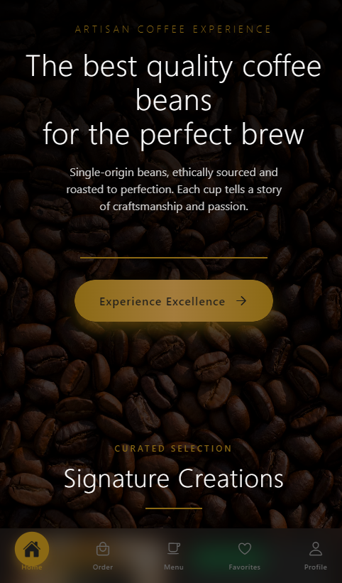

<<<<<<< HEAD
# Welcome to your Expo app 👋

This is an [Expo](https://expo.dev) project created with [`create-expo-app`](https://www.npmjs.com/package/create-expo-app).

## Get started

1. Install dependencies

   ```bash
   npm install
   ```

2. Start the app

   ```bash
   npx expo start
   ```

In the output, you'll find options to open the app in a

- [development build](https://docs.expo.dev/develop/development-builds/introduction/)
- [Android emulator](https://docs.expo.dev/workflow/android-studio-emulator/)
- [iOS simulator](https://docs.expo.dev/workflow/ios-simulator/)
- [Expo Go](https://expo.dev/go), a limited sandbox for trying out app development with Expo

You can start developing by editing the files inside the **app** directory. This project uses [file-based routing](https://docs.expo.dev/router/introduction).

## Get a fresh project

When you're ready, run:

```bash
npm run reset-project
```

This command will move the starter code to the **app-example** directory and create a blank **app** directory where you can start developing.

## Learn more

To learn more about developing your project with Expo, look at the following resources:

- [Expo documentation](https://docs.expo.dev/): Learn fundamentals, or go into advanced topics with our [guides](https://docs.expo.dev/guides).
- [Learn Expo tutorial](https://docs.expo.dev/tutorial/introduction/): Follow a step-by-step tutorial where you'll create a project that runs on Android, iOS, and the web.

## Join the community

Join our community of developers creating universal apps.

- [Expo on GitHub](https://github.com/expo/expo): View our open source platform and contribute.
- [Discord community](https://chat.expo.dev): Chat with Expo users and ask questions.
=======
# coffee-shop-web-app
Kapehan is a premium coffee shop app offering an elegant, animated experience for discovering and ordering artisan coffee creations with luxury design and smooth interactions.
>>>>>>> 5d829d63ea03b21a0c938c7882daf5f221a19d1e

# ☕ Kapehan - Premium Coffee Shop App

A luxury React Native/Expo coffee shop application featuring elegant design, smooth animations, and 28+ artisan coffee creations.

## 📸 App Screenshots

| Home Screen | Menu Screen |
|-------------|-------------|
|  |  |

| Favorites Screen | Profile Screen |
|------------------|----------------|
|  |  |

## ✨ Features

- **28+ Premium Coffee Drinks** across 4 categories (Featured, Classic, Iced, Seasonal)
- **Beautiful 2-Column Menu** with professional photography
- **Smooth Animations** - Add to cart effects, shimmer loading, parallax scrolling
- **Luxury Design** - Dark theme with gold accents, premium typography
- **Interactive Cart** - Real-time updates with floating notifications
- **Responsive Design** - Optimized for all mobile devices

## 🛠️ Tech Stack

- **Frontend**: React Native, Expo, TypeScript
- **Navigation**: Expo Router
- **Styling**: React Native StyleSheet
- **Icons**: Expo Vector Icons
- **Animations**: React Native Animated API
- **Background Effects**: Expo Blur, Linear Gradient

## 🚀 Getting Started

```bash
# Clone repository
git clone https://github.com/bojji3/coffee-shop-web-app.git

# Install dependencies
npm install

# Start development
npx expo start